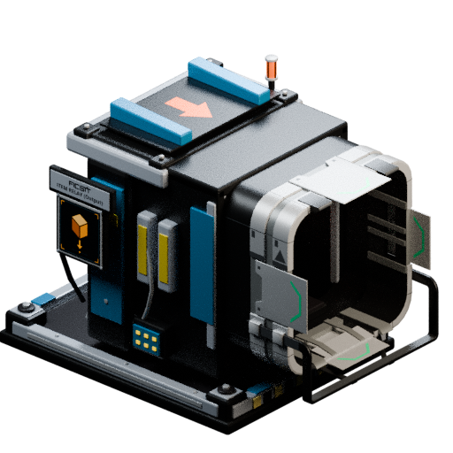
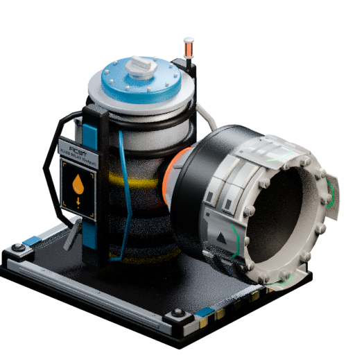
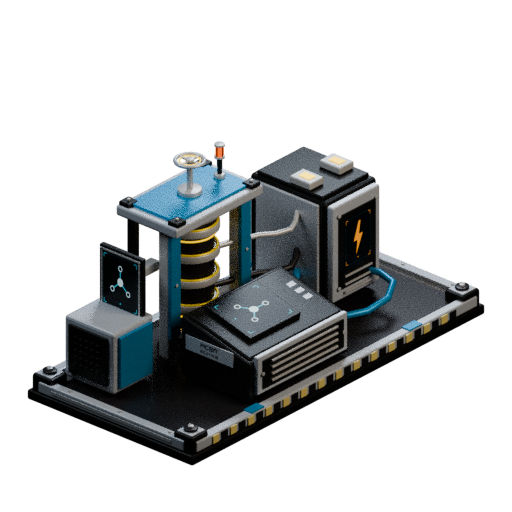

# Relay 0.4.6: UI layout, paint accents and connection lighting

The reported windows let controls overlap the route editor and footer. Runtime windows used reconstructed Blueprint frame/button wrappers while geometry tests exercised different Slate fallbacks. Both paths now use the same explicitly sized Slate frame and buttons, retaining the native interaction widget lifecycle, game font and SFUIKIT panel art. Endpoint and hub designs fit within a fixed logical layout and scale down together; only the active data list scrolls. Panel padding, metric headings and frame controls were adjusted.

Large item housings, rear shoulders, covers and hub cabinets now use neutral factory metal. Customizer colours apply to trim, braces and smaller panels. The fluid vessel stays neutral with a narrow secondary-colour band. No connector transforms, mesh scale or triangle topology changed. The blue/yellow preview renders demonstrate the material assignments; they are Blender previews, not game captures.

Endpoint lights and screens now follow physical belt/pipe attachment. The server checks connection state every 0.2 seconds and replicates changes to clients. Material work stays on the game thread and repairs Customizer overrides. Native connector emissive faces share the switchable signal slot, so their arrows also go dark. Hub lighting continues to follow actual hub power. Transport behavior is unchanged.

## Verification

- Five native Unreal automation tests passed, including connection lighting, replication declaration, worker-thread rejection and interaction lifecycle. The layout/snapshot test passed with 25 reconstructed Blueprint warnings.
- Layout geometry checked at 1920x1080, 1280x720 and 960x540, each at 100%, 150% and 200% DPI, with powered and unpowered hub states. Checks cover editable field bounds, search/editor separation, footer clearance and one active scrolling list.
- Seven transport scenarios and 60,000 randomized conservation steps passed.
- Model checks passed: native connector retention, closed rear geometry, flush display UVs, stable connection transforms and no emissive factory-atlas faces outside the switchable signal material.
- Offline viewer exercised all five models, surfaces, cameras, lights, keyboard controls and mobile layout without browser errors.

- Windows Steam/Epic and dedicated server Shipping build, cook and stage succeeded.

## Native surface detail research

The modeling documentation describes MM_Factory_Array mixing detail textures over the colour atlas, with instances controlling overlay density. Relay uses the native MI_Factory_Base_01 material in-game; its standalone previews currently use the plain atlas and do not reproduce that full shader. Colour and normal decals in the common connector meshes add surface detail. No additional grunge overlay was introduced in this release. Source: https://docs.ficsit.app/satisfactory-modding/latest/Development/Modeling/MainMaterials.html

## Remaining live acceptance

In-game appearance and real multiplayer connection changes still need testing. Check Escape and reopening; endpoint and hub layout at your UI scale; attach/remove each belt and pipe; load existing endpoints; paint while disconnected; and verify the same behavior on a joining client. The geometry tests are not a claim of screenshot-level in-game acceptance.

## Previews

