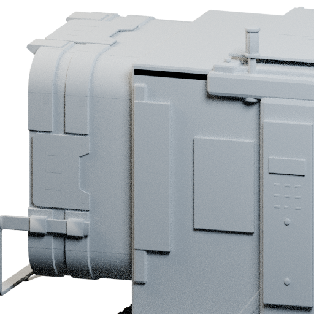
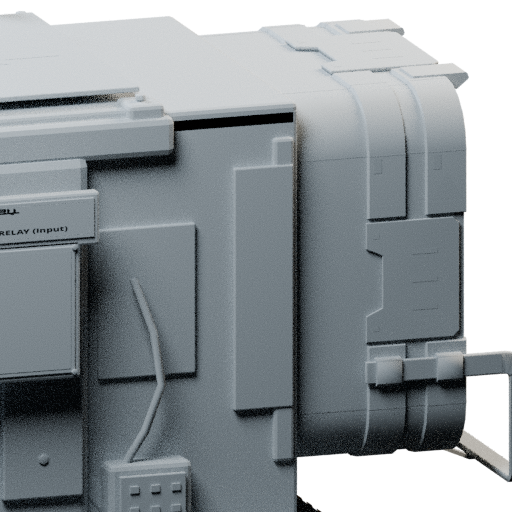

# Relay 0.4.7: audit implementation

This release implements the technical and model changes identified in the style audit. The Windows client and dedicated-server archives built successfully and are ready for live acceptance; it is not a claim that native material appearance, fog depth or large-factory performance have been measured in the running game.

## Implemented

- Replaced per-vertex fractional UV wrapping with continuous, proportional projection into factory-atlas cells. Faces no longer fold across wrapping boundaries. The material remains native and paint regions remain separate from neutral housings.
- Replaced modeled FICSIT lettering and bumper hazard blocks with a single shared masked colour atlas. Existing native connector colour/normal decals remain. Important silhouette-changing bolts and service panels stay modeled.
- Added two reduced source LODs per model, with all decal faces removed from those distant levels. LOD thresholds are screen sizes 0.10 and 0.035, rather than the old close-range automatic LargeProp reduction chain.
- Added authored box collision, preserving the open belt/pipe paths. The cooked assets are checked for the expected box count.
- Added a separate non-colliding InputFog surface inside each item collar, ahead of the conveyor connection. Fog is visual only; it does not alter intake timing.
- Reduced screen emission from 2.2 to 1.1. Physical connection and hub-power lighting rules remain intact.
- Explicitly opted placed Relay buildings into saving, excluding dismantled actors. Added a SaveGame archive round-trip test for identity, label, route and cargo count.
- Added native route copy/paste, with transport-type matching. The server resolves the copied route identity and applies existing authority, reach, rate, buffer and in-flight transfer checks. It does not copy contents or bypass reassignment restrictions.
- Removed the item supports enclosed by the side walls. The circular chamber, visible belt interior and external service details remain; the user's earlier preference to retain the circle is preserved.
- Added near/medium/far controls to the offline viewer using the actual exported LOD meshes.

## Connector-specific review

A straight rear view checks the building bulkhead, not the back of the connector collar. The final review therefore includes close side angles of the collar-to-housing junction, plus light-clay views from both sides. Forty oblique ray checks per item model reach the intended near-side junction surface. These checks cover the identified junction rather than claiming every possible view is proven.

## Validation

Six native automation tests passed, including the new serialization and clipboard test. The layout/snapshot test reports the existing reconstructed Blueprint warnings. The SDK inventory constructor is stubbed, so the fixture explicitly initializes its stack count; this is not evidence that the real game inventory constructor is faulty.

The portable transport suite, model integrity checks, open-connector collision checks, descending LOD triangle counts, distant decal removal and offline viewer checks passed. Native content inspection verifies three LODs, material bindings and authored collision counts.

## Remaining live acceptance

- Compare the panel finish directly against stock parts with the same paint finish and lighting. No arbitrary grunge layer was added; the UV defect was addressed first.
- Connect each belt/pipe, inspect fog entry in motion and verify item throughput. Check that the fade is not too abrupt or too deep.
- Check LOD transitions from both sides and inside the connector view. Verify full rear closure at distance.
- Save/load a real factory containing nonempty buffers and route assignments; then repeat with a joining client and dedicated server.
- Check route copy/paste success and rejection with nonempty buffers.
- Profile many placed relays. Reduced triangle counts are not a measured FPS improvement.

The standalone renderer remains an approximation of native factory shading. The surface match and final style acceptance remain subject to in-game review.
