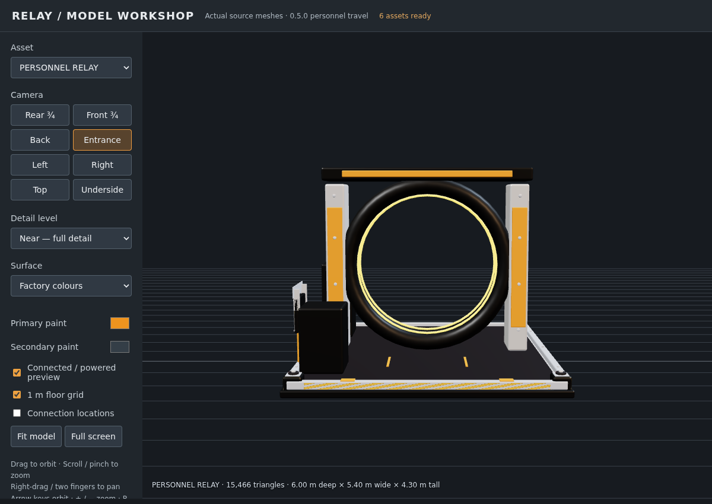
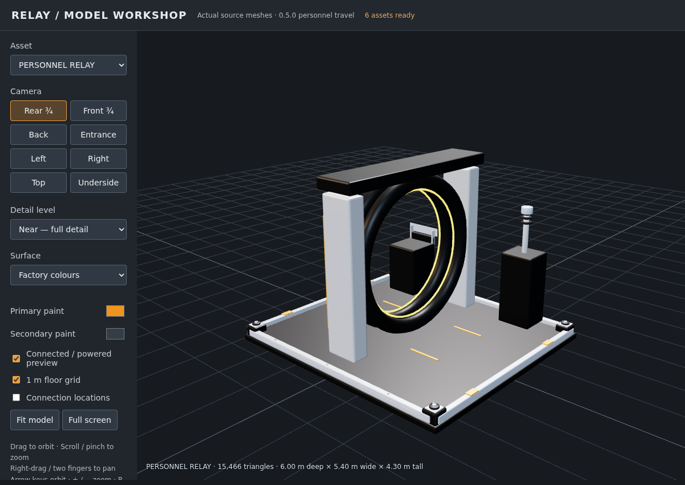
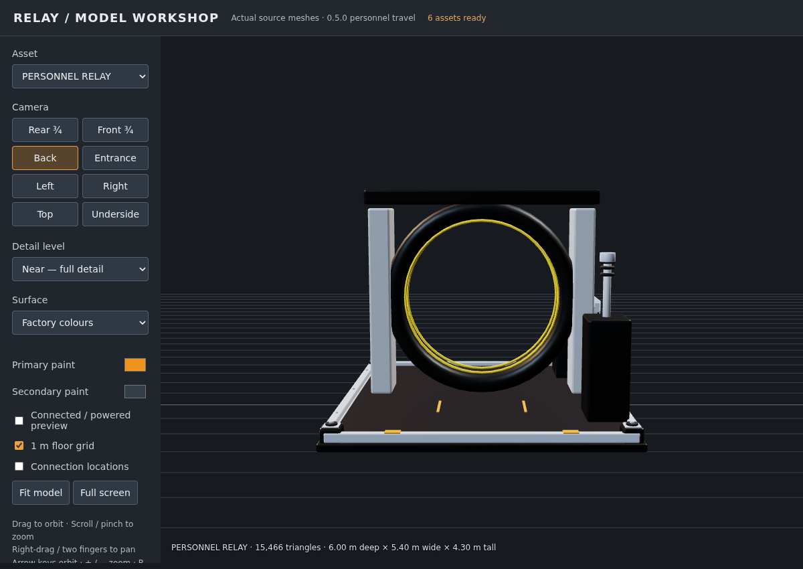
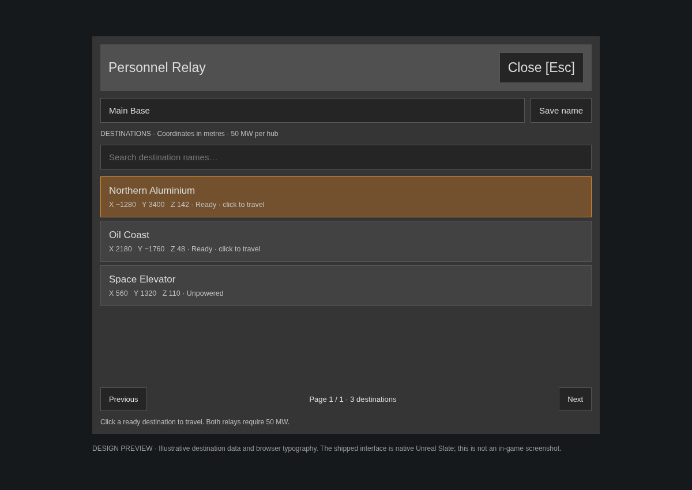

# Relay 0.5.0 — Personnel Relay feature report

**Feature branch:** `feature/player-teleporter`  
**Rollback baseline:** `baseline` / `609ad87` (Relay 0.4.10)  
**Target:** Steam/Epic game CL502094, CSS Unreal 5.6.1, SML 3.12.0.

Personnel Relay adds player travel between a new family of powered hubs. It is separate from the existing logistics hub and item/fluid routes. Implementation, models and local validation are provided; **actual game travel, stock transition presentation and multiplayer acceptance must still be tested in Satisfactory.** This environment has the reconstructed modding SDK, not a running copy of the game.

## Player flow

1. Unlock **Relay Personnel Transport** at **Tier 9** in the HUB.
2. Build at least two **PERSONNEL RELAY** buildings from the Relay Network build category. Connect each to power.
3. Approach a hub and press **E** (the configured Use key).
4. Optionally name the current hub. Search the destination list; each row shows its name, XYZ coordinates in metres and Ready / Unpowered / Cooldown status.
5. Click a ready destination to travel. The server validates both hubs and their landing space, closes the UI after travel starts, and invokes the native portal player path.
6. Escape or Close closes the directory normally. The menu has one scrolling list, fixed controls, 32-row pages and a one-second directory refresh.

Only Personnel Relays are destinations. Existing logistics hubs remain management buildings.

## Unlock and operating costs

| Resource / setting | HUB milestone | Each building |
|---|---:|---:|
| Time Crystals | 200 | 20 |
| Supercomputers | 100 | 10 |
| Turbo Motors | 50 | 5 |
| Tier | 9 | After milestone |
| HUB dispatch time | 300 seconds | — |
| Power | — | 50 MW continuous |

Both departure and destination must have power. There is no singularity-cell fuel cost. The expensive Tier 9 construction and 100 MW combined operating load are the initial balance choice. Each journey reserves both hubs for 30 seconds; an occupied hub cannot accept another departure/arrival or be dismantled during that reservation.

## Native portal reuse and transitions

The implementation subclasses `AFGBuildablePortalBase` and calls the server-only `AFGCharacterPlayer::StartPortal(source, destination)`. Its portal surface sits at the model ring centre, 220 cm above the origin. A native curve supplies 1.5 seconds at zero distance and 3.5 seconds at 10 km, with a 25-second native maximum travel time.

The SDK exposes player portal state, entry/exit transforms, travel duration, multicast state updates and a client level-streaming completion acknowledgement. Reusing that player path is intended to retain stock player transition/streaming behavior. **The SDK's generated implementation of `StartPortal` is empty; successful compilation and automation cannot establish the actual in-game animation, audio, arrival behavior or multiplayer replication.** The feature therefore needs the live tests below before being treated as release-ready.

The custom actor bypasses the native paired-portal factory tick and native teleport power-spike callbacks. It does not join power grids, link a main/satellite pair, or consume native portal fuel. It supplies the portal transforms and its own constant power requirement.

A short collision-checked move places the player on the local departure pad to normalize entry offset before native travel. If the native portal state does not start, the prior transform is restored and the UI shows an explicit error. There is no raw long-distance fallback that could drop the player into unloaded terrain.

The model currently has static rings and powered lamps/screens. It does **not** contain a new skeletal animation, moving iris, Niagara portal surface or custom fade sequence. Those are possible follow-up effects after the stock presentation has been verified, so we do not double-play fades/audio or conflict with streaming timing. See [the full implementation plan and alternatives](../docs/personnel-relay-plan.md).

## Asset review

The new model uses the existing native factory atlas and Relay's shader-safe opaque printed details, screen and zero-emission materials. Large structural surfaces remain metal/dark neutral; orange paint is used on smaller armour strips and indicators. The rear is intentionally open because this is a personnel ring with landing pads on both sides.

| Asset property | Value |
|---|---|
| Source | `assets/models/SM_RelayTravelHub.obj` |
| Envelope | 6.00 m deep × 5.40 m wide × 4.30 m tall |
| LOD0 / LOD1 / LOD2 | 15,466 / 8,504 / 3,710 triangles |
| Authored collision | Six boxes; both centre landing pads remain clear |
| Runtime power socket | X −180, Y +220, Z +310 cm (Unreal; Blender Y is mirrored) |
| Material slots | factory, signal, screen, decal_custom |
| Descriptor / milestone captures | 256 px and 512 px, transparent background |
| Map marker | Existing Relay hub glyph with Personnel Relay name |

### Descriptor asset render

### Front and oblique rear inspection

These are screenshots of the actual OBJ meshes in the updated offline viewer. Viewer lighting/material previews approximate the game; they are not Windows in-game screenshots.

The viewer now contains all six models, three LODs, orbit/pan/zoom controls, orthographic-like inspection angles, paint previews, connection markers and a powered/unpowered preview. Open `dist/Relay-model-viewer.html` locally, or use the versioned viewer ZIP. No external web requests are required.

### Interface design reference

This image is an illustrative browser preview of the layout with sample destinations, **not a screenshot of the shipped Slate widget**. Actual typography/controls must be checked in game. The native widget's directory sequencing, request bounds and Escape lifecycle are covered by automation.

## Implementation and safeguards

- Player-owned SML Remote Call Object; server-owned hub lookup and travel decisions. Requests identify the destination by a stable GUID, not a client-supplied transform or a distant replicated actor pointer.
- Saved hub GUID/name, replicated name updates, duplicate-ID repair for copied live hubs.
- Directory and result replies are scoped to their source hub; sequence numbers and query checks reject older directory snapshots. One in-flight poll avoids starving replies on slow connections. Search/rename inputs and page sizes are bounded; server request throttles limit repeated actions.
- Travel rejects invalid/dismantled hubs, remote use beyond five metres from the source bounds, dead players, players driving vehicles, players already in portal travel, unpowered/busy hubs and blocked landing capsules on either destination side.
- No inventory removal, recreation or item transfer is performed by this feature.
- UI polling stops during a pending request, with a ten-second UI request timeout. Close removes delegate bindings, clears its timer and pops only its own native interaction widget.
- Power visuals update on the game thread. Scalar parameters change only with the power state; material bindings are restored if the Customizer resets them. Dedicated servers skip visual material updates. This preserves the earlier renderer thread-safety fix and opaque detail-material crash hotfix.

## Validation evidence

Final build/test results are recorded in `0.5.0-validation.txt` and `0.5.0-automation.json` alongside this report. Checks cover native editor compilation, native automation, imported Tier 9 costs/rewards/icons, material bindings, collision and LODs, existing transport conservation tests, and offline model-viewer interaction.

Steam, Epic and Windows dedicated-server Shipping builds and both platform cooks completed successfully. The release archives include the new retained model, icons and native classes.

All seven native tests passed; one existing logistics UI test emitted reconstructed SDK Blueprint warnings. The new Personnel test passed without warnings.

A test-fixture ownership error was found and corrected: an RCO must be created under an `AFGPlayerController`, including in tests. This was a fixture error; live RCO creation is registered through SML's player-owned path.

## Live-game acceptance checklist

These checks remain **pending** and are not implied by successful packaging:

- Install the same 0.5.0 build on host and clients. Load a copy of a save with Tier 9 available; verify HUB icon, all three milestone costs, construction recipe and model icon.
- Build two hubs, connect power, rename them and open each directory immediately. Confirm coordinates, search, empty list and unpowered states.
- Travel a short distance and then several kilometres into an initially unloaded region. Confirm the native transition ends, terrain is loaded, the landing is clear and mouse/keyboard control returns. Check the inventory and equipped items are unchanged.
- Repeat with a remote listen-server client and a dedicated-server client, including two players attempting the same destination simultaneously.
- Place an obstacle on either landing pad; verify rejection. Cut power before clicking a destination; verify rejection. Check cooldown and dismantle lock.
- Close with Escape while a text field is focused; open another machine afterward; confirm no stranded overlay or input lock.
- Save/reload, rename, dismantle and rebuild. Blueprint-copy a hub and verify both copies appear with distinct destinations.
- Observe power-off lamps, power cable alignment, Customizer accents, model collision and DX12 world loading.

If the menu reports “Native portal travel did not start”, the game rejected or did not activate the native state. Capture `FactoryGame.log`; the feature emits `Relay Personnel: native travel requested` with source/destination IDs. Do not treat a successful directory or asset preview as a successful transit test.

## Installation and rollback

Use the versioned Windows archive from `dist` for Steam or Epic; a separate WindowsServer archive is provided for dedicated servers. Extract the Relay plugin into the game's `FactoryGame/Mods/Relay` using the same local-mod installation method as the previous test builds. Do not nest a second `Relay` directory or mix binaries from different versions.

Keep the existing 0.4.10 package and a **pre-feature save copy**. Code rollback is `git switch baseline`; this does not erase the feature branch. Package rollback requires reinstalling 0.4.10 and loading the pre-feature save. Switching Git branches alone does not roll back an installed game or a save containing Personnel Relay actors.

## Research references

- [Satisfactory modeling style](https://docs.ficsit.app/satisfactory-modding/latest/Development/Modeling/style.html): industrial silhouettes, limited shared materials and modular atlas details informed the asset choices.
- [Epic World Partition](https://dev.epicgames.com/documentation/en-us/unreal-engine/world-partition-in-unreal-engine): destination streaming before teleport informed use of the native portal path rather than an unguarded world-position jump.
- Local CL502094 SDK headers: `FGCharacterPlayer.h`, `Buildables/FGBuildablePortalBase.h`, `FGRemoteCallObject.h`, `UI/FGInteractWidget.h`. These provide the actual compiled API contract; reconstructed function bodies do not substitute for live-game acceptance.
