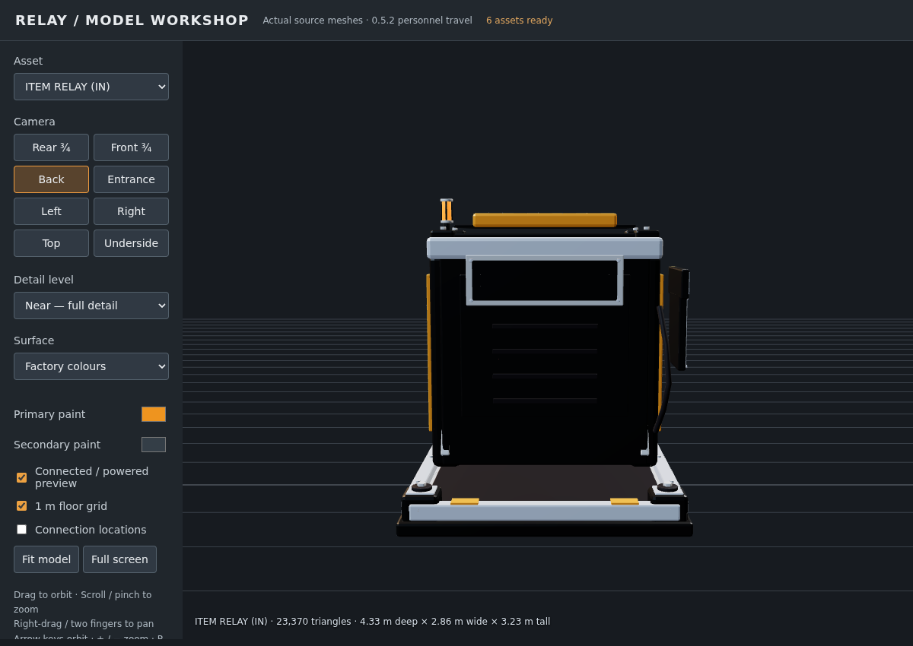
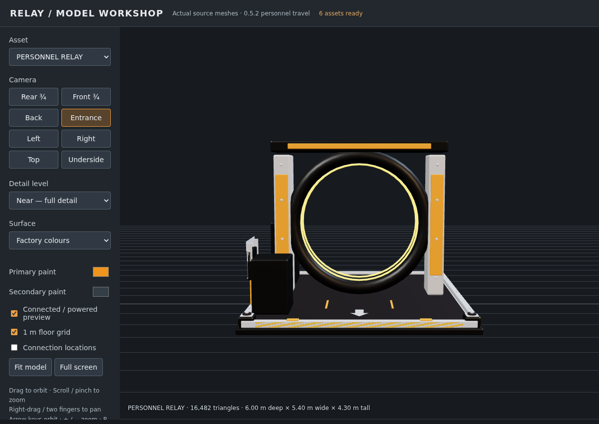
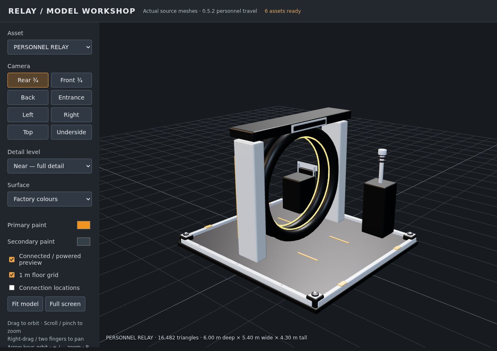

# Relay 0.5.2 — Personnel UI, map sections and arrival polish

Built on `feature/player-teleporter`. Includes the 0.5.1 native milestone reward-wrapper fix.

## Interface and destination icons

The Personnel directory now uses Relay's compact native composite font, flat button/input styles and the SFUIKIT panel texture. Its design size is 820 × 520 instead of 880 × 690 and it scales down to fit. Button captions stay on one line. There is one scrollable area; the icon picker replaces the destination list instead of adding another floating window.

Choose **Choose icon**, search the native sign-icon database and click an icon. The picker shows 42 icons per page, with tooltips, a default-icon reset and Back to destinations. Destination rows show their saved icons alongside names, coordinates and state. Static texture icons are supported; hidden/animated entries are excluded and unsupported resources are rejected by the server. The chosen `FPersistentGlobalIconId` is saved and replicated, so it is not a hardcoded texture path or a fragile cross-save numeric index. Search-only icons appear when searching.

The directory's existing travel action remains one click. Icon/name changes are server validated against the interacting player's source hub and distance. A directory reply cannot overwrite the active picker. Escape closes the entire interaction cleanly.

## Map categories

Logistics endpoints and management hubs use **Relay Logistics**. Personnel hubs use **Relay Personnel**. Stock portals retain their existing category. These use runtime representation types and an SML return-value hook for the native map category label. Unrelated category labels pass through unchanged. Enum expansion and UI hooking are disabled in the editor/commandlets to avoid baking transient values into assets.

The approach was researched against the [SignalTriangulation implementation](https://github.com/af-chacon/SignalTriangulation), then implemented for Relay using the local SML 3.12 hook APIs. Custom map category behavior must be checked in the actual game with the same mod set on clients/server; editor automation intentionally does not modify the engine enum.

## Dismantling and arrival

Logistics buildings now unregister explicitly during dismantling instead of waiting only for EndPlay. Their registration retry cannot re-register a removed building. Snapshot counts exclude dismantled/destroying endpoints and channels with no live hub. Personnel directory scans exclude removed, dismantled, destroying, template and not-yet-started actors, and travel revalidates the destination. Empty named routes can remain as configuration records; they are not registered buildings.

Personnel placement uses a dedicated hologram class with a temporary arrow pointing toward local +X, the marked front/exit. The mesh also carries a flat floor arrow on that side. After native travel completes, a short collision-checked landing adjustment uses that pad. View pitch/roll reset to level and the heading faces out; the owning client receives the camera rotation on the following tick so it follows native completion. If the front pad becomes obstructed during travel, the collision-checked move may fail; the player keeps the native landing and faces outward on that side.

## Sign mounting and model review

All six models now have flat rear-facing mounting pads, seated support brackets/bolts and matching collision surfaces for vanilla wall signs. Item mounts are on the rear, above the service vents; fluid mounts sit high on the tank rear; logistics hub and Personnel crown also have pads. These are physical mounting surfaces, **not automatic sign snap sockets**. Sign placement and supported sign sizes need a live-game check. Conveyor/pipe mouths and travel landing pads remain clear.

These are actual model-viewer screenshots, not in-game captures. The offline viewer includes all six updated meshes and three LODs. The [UI layout preview](personnel-teleporter-ui-0.5.2-preview.html) is a browser design reference, not native-game evidence.

## Validation and next game test

Native editor build, seven native automation tests, transport conservation tests, retained-content inspection and model-viewer checks passed. The new checks cover icon RPC bounds, save/replication flags and keeping directory responses out of the icon picker. One existing automation test retains reconstructed-SDK Blueprint warnings. Native map hooks, real sign resources, placement-arrow rendering, wall-sign placement and final arrival camera behavior still require game acceptance.

Install the complete 0.5.2 build, then test:

1. Open both HUB milestones and check reward icons.
2. Choose different destination icons, save/reload, and check another client's list.
3. Check separate map sections and independent visibility toggles.
4. Dismantle a hub/endpoint and check the next directory refresh; reload and check again.
5. Rotate a Personnel placement hologram; compare its arrow with the floor arrow and travel arrival direction. Repeat between hubs at different rotations and with a remote client.
6. Mount a vanilla wall sign on each rear pad. Verify collision does not interfere with belts, pipes or landing areas.

Final Windows packaging: Steam, Epic and Windows dedicated-server Shipping builds and both platform cooks succeeded; AutomationTool ExitCode=0.
